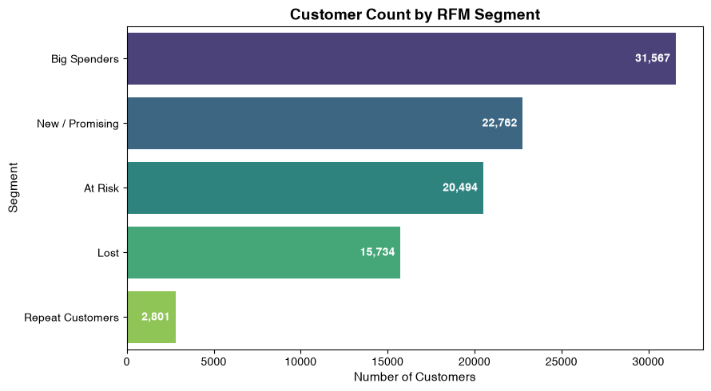
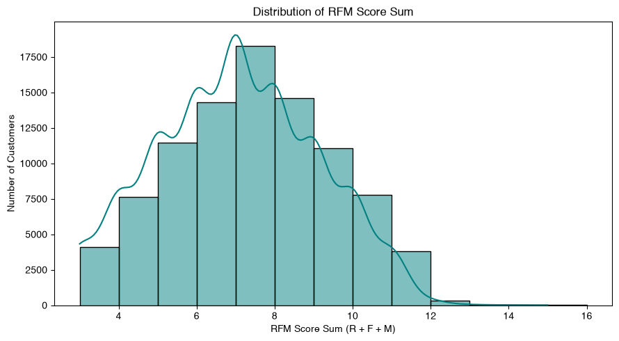
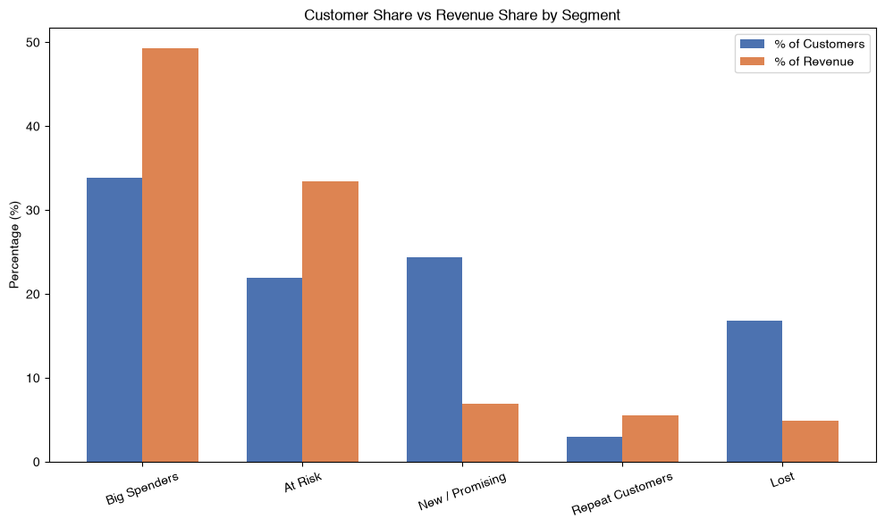
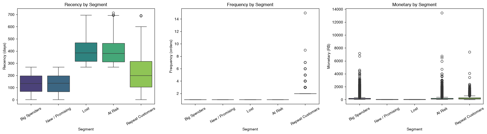

# Customer Segmentation using RFM Analysis

An end-to-end RFM (Recency, Frequency, Monetary) customer segmentation pipeline built on the [Brazilian E-Commerce Public Dataset by Olist](https://www.kaggle.com/datasets/olistbr/brazilian-ecommerce) (Kaggle), covering 93,358 customers across 96,478 orders.

**Stack:** MySQL (storage, star schema) · Python (Pandas, SQLAlchemy) · Matplotlib/Seaborn · Plotly · Jupyter Notebook

## Key Insight

Revenue is concentrated: **Big Spenders + At Risk = ~56% of customers but ~83% of revenue.**

| Segment | % Customers | % Revenue |
|---|---|---|
| Big Spenders | 33.8% | 49.3% |
| At Risk | 22.0% | 33.4% |
| New/Promising | 24.4% | 6.9% |
| Repeat Customers | 3.0% | 5.5% |
| Lost | 16.9% | 4.9% |

Full breakdown and retention recommendations per segment → [BUSINESS_INTERPRETATION.md](./BUSINESS_INTERPRETATION.md)

## Methodology

1. **Data pipeline:** Olist CSVs loaded into MySQL, joined into a star schema (fact = order-line grain; dims = customers, products, sellers). Base RFM dataset pulled via SQL join, filtered to delivered orders.
2. **RFM scoring:** Recency and Monetary scored via quantile binning (`pd.qcut`); Frequency manually bucketed (1→1, 2→2, 3→3, 4→4, 5+→5) since **~97% of customers are one-time buyers**, which breaks standard quantile scoring for that metric.
3. **Segmentation:** R×M quadrants with Frequency as an override flag — five segments: Repeat Customers, Big Spenders, New/Promising, At Risk, Lost.
4. **Visualization:** segment size distribution, R/F/M distributions per segment (interactive), score distribution, and revenue concentration by segment.

## Visualizations





### Interactive R/F/M distributions
Static preview below — click through for the interactive Plotly versions (zoomable, hoverable):



- [Recency by segment (interactive)](https://kartik720.github.io/rfm-segmentation/charts/recency_boxplot.html)
- [Frequency by segment (interactive)](https://kartik720.github.io/rfm-segmentation/charts/frequency_boxplot.html)
- [Monetary by segment (interactive)](https://kartik720.github.io/rfm-segmentation/charts/monetary_boxplot.html)

## Repository Structure

```
rfm-segmentation/
├── README.md
├── BUSINESS_INTERPRETATION.md
├── notebook/
│   └── RFM_customer_segmentation.ipynb
├── sql/
│   ├── dimensions_table.sql
│   └── RFM_raw_query.sql
├── src/
│   └── olist.py
├── images/
├── charts/
└── docs/
    └── index.html
```

| File/Folder | Purpose |
|---|---|
| `README.md` | Project overview, key insight, and links to all resources |
| `BUSINESS_INTERPRETATION.md` | Full segment-by-segment retention recommendations |
| `notebook/` | Complete analysis notebook — SQL pipeline, RFM scoring, visualizations |
| `sql/dimensions_table.sql` | Star schema build (fact + dimension tables) |
| `sql/RFM_raw_query.sql` | Base RFM dataset extraction query |
| `src/olist.py` | Loads raw Olist CSVs into MySQL |
| `images/` | Static chart exports (segment counts, score distribution, revenue concentration) |
| `charts/` | Interactive Plotly exports (R/F/M distributions by segment) |
| `docs/` | GitHub Pages site embedding the interactive charts |

## Notebook

Full analysis, code, and narrative → [RFM_customer_segmentation.ipynb](notebook/RFM_customer_segmentation.ipynb)
